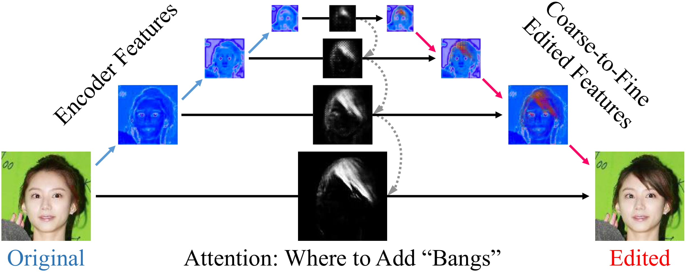
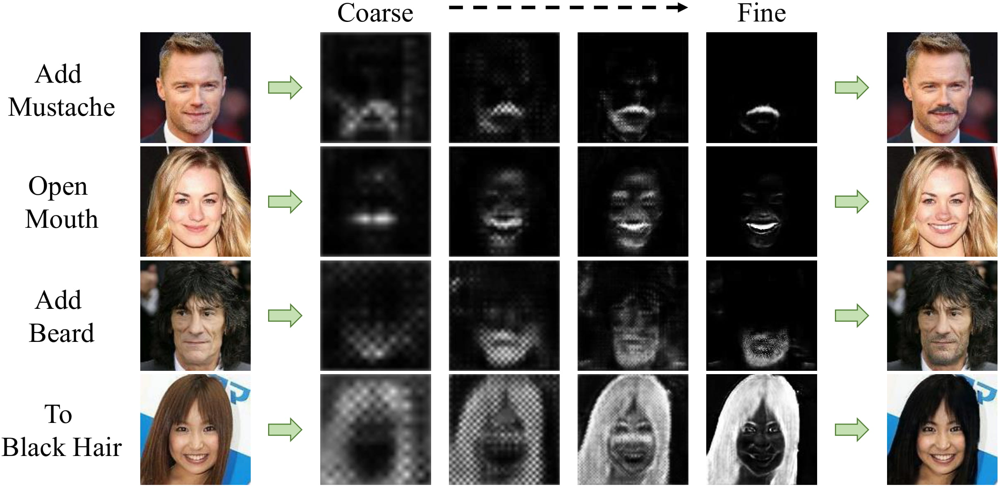
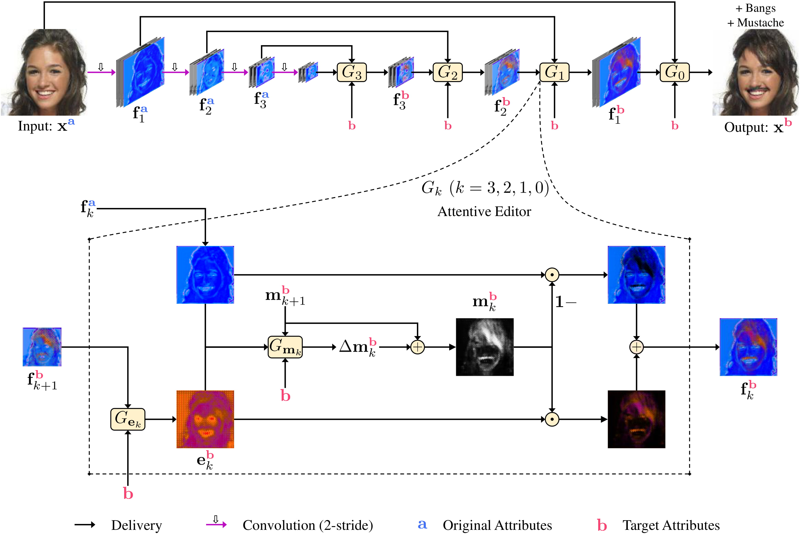

<p align="center"> &nbsp;&nbsp;&nbsp;&nbsp;&nbsp;&nbsp;&nbsp;&nbsp;&nbsp;&nbsp;&nbsp;&nbsp;&nbsp;&nbsp;&nbsp;&nbsp;&nbsp;&nbsp; </p>

---

# <p align="center"> PA-GAN </p>

**Tensorflow** implementation of **PA-GAN**: Progressive Attention Generative Adversarial Network for Facial Attribute Editing

<p align="center">  </p>


# Usage

- Environment

    - Python 3.6

    - Tensorflow 1.13

    - OpenCV, scikit-image, tqdm, oyaml


    - (we recommend [Anaconda](https://www.anaconda.com/distribution/#download-section) or [Miniconda](https://docs.conda.io/en/latest/miniconda.html#linux-installers), then you can build the PA-GAN environment with the commands below)

        ```console
        conda create -n PA-GAN python=3.6

        source activate PA-GAN

        conda install -c anaconda tensorflow-gpu=1.13

        pip install tensorflow-graphics-gpu --no-deps

        conda install -c anaconda opencv

        conda install -c anaconda scikit-imagey

        conda install -c anaconda tqdm

        conda install -c conda-forge oyaml
        ```

- Data Preparation

    - [CelebA](http://openaccess.thecvf.com/content_iccv_2015/papers/Liu_Deep_Learning_Face_ICCV_2015_paper.pdf)-unaligned (10.2GB, higher quality than the aligned data)

        - download the dataset

            - img_celeba.7z (move to **./data/img_celeba/img_celeba.7z**): [Google Drive](https://drive.google.com/drive/folders/0B7EVK8r0v71pTUZsaXdaSnZBZzg) or [Baidu Netdisk](https://pan.baidu.com/s/1eSNpdRG#list/path=%2Fsharelink2785600790-938296576863897%2FCelebA%2FImg&parentPath=%2Fsharelink2785600790-938296576863897)

            - annotations.zip (move to **./data/img_celeba/annotations.zip**): [Google Drive](https://drive.google.com/file/d/1xd-d1WRnbt3yJnwh5ORGZI3g-YS-fKM9/view?usp=sharing)

        - unzip and process the data

            ```console
            7z x ./data/img_celeba/img_celeba.7z/img_celeba.7z.001 -o./data/img_celeba/

            unzip ./data/img_celeba/annotations.zip -d ./data/img_celeba/

            python ./scripts/align.py
            ```

- Commands

    - training

        ```console
        CUDA_VISIBLE_DEVICES=0 python train.py
        ```

    - testing

        - **single** attribute editing

            ```console
            CUDA_VISIBLE_DEVICES=0 python test.py
            ```


        - **multiple** attribute editing example

            ```console
            CUDA_VISIBLE_DEVICES=0 python test_multi.py --test_att_names Bushy_Eyebrows Mustache
            ```

    - loss visualization

        ```console
        CUDA_VISIBLE_DEVICES='' tensorboard --logdir ./output/default/summaries --port 6006
        ```