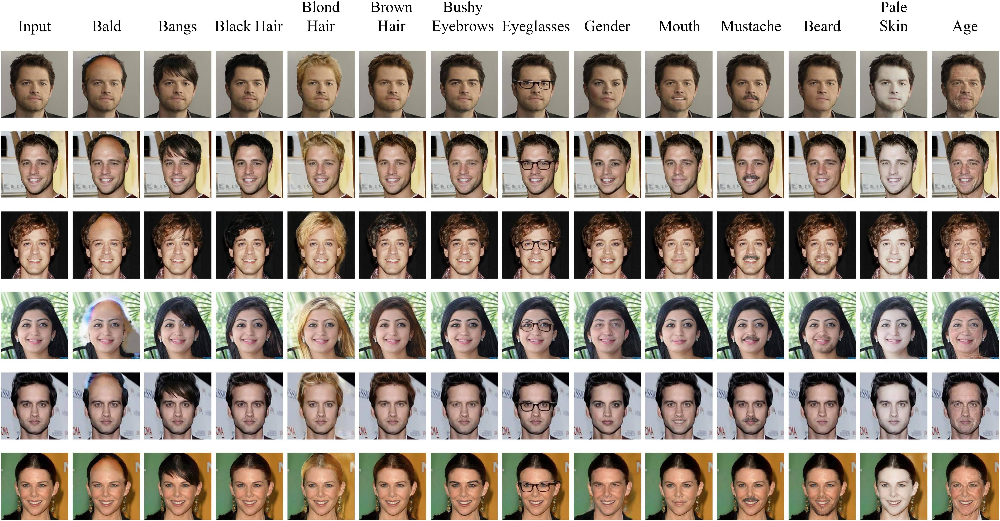

<p align="center">  </p>
<p align="center"> &nbsp;&nbsp;&nbsp;&nbsp;&nbsp;&nbsp;&nbsp;&nbsp; </p>


<h1 align="center"> 
    <a href="https://arxiv.org/pdf/2007.05892">PA-GAN</a>
</h1>

> **<a href="https://arxiv.org/pdf/2007.05892">PA-GAN: Progressive Attention Generative Adversarial Network for Facial Attribute Editing</a>** \
> [Zhenliang He](https://lynnho.github.io)<sup>1,2</sup>, [Meina Kan](https://scholar.google.is/citations?user=4AKCKKEAAAAJ)<sup>1,2</sup>, [Jichao Zhang](https://scholar.google.com/citations?user=SPEECTIAAAAJ&hl=zh-CN)<sup>1,2,3</sup>, [Shiguang Shan](https://scholar.google.com/citations?user=Vkzd7MIAAAAJ)<sup>1,2</sup> \
> <sup>1</sup>Key Lab of Intelligent Information Processing, Institute of Computing Technology, CAS, China \
> <sup>2</sup>University of Chinese Academy of Sciences, China \
> <sup>3</sup>Peng Cheng Laboratory, China

<p align="center">  </p>


## Usage

- Environment

    - Python 3.6

    - TensorFlow 1.13+, TensorFlow Graphics

    - OpenCV, scikit-image, tqdm, oyaml

    - *we recommend [Anaconda](https://www.anaconda.com/distribution/#download-section) or [Miniconda](https://docs.conda.io/en/latest/miniconda.html#linux-installers), then you can create the PA-GAN environment with commands below*

        ```console
        conda create -n PA-GAN python=3.6

        source activate PA-GAN

        conda install opencv scikit-image tqdm tensorflow-gpu=1.13

        conda install -c conda-forge oyaml

        pip install tensorflow-graphics-gpu --no-deps
        ```

    - *NOTICE: if you create a new conda environment, remember to activate it before any other command*

        ```console
        source activate PA-GAN
        ```

- Data Preparation

    - [CelebA](http://openaccess.thecvf.com/content_iccv_2015/papers/Liu_Deep_Learning_Face_ICCV_2015_paper.pdf)-unaligned (10.2GB, higher quality than the aligned data)

        - download the dataset

            - img_celeba.7z (move to **./data/img_celeba/img_celeba.7z**): [Google Drive](https://drive.google.com/drive/folders/0B7EVK8r0v71pTUZsaXdaSnZBZzg) or [Baidu Netdisk](https://pan.baidu.com/s/1CRxxhoQ97A5qbsKO7iaAJg) (password rp0s)

            - annotations.zip (move to **./data/img_celeba/annotations.zip**): [Google Drive](https://drive.google.com/file/d/1xd-d1WRnbt3yJnwh5ORGZI3g-YS-fKM9/view?usp=sharing)

        - unzip and process the data

            ```console
            7z x ./data/img_celeba/img_celeba.7z/img_celeba.7z.001 -o./data/img_celeba/

            unzip ./data/img_celeba/annotations.zip -d ./data/img_celeba/

            python ./scripts/align.py
            ```

- Run PA-GAN

    - training

        ```console
        CUDA_VISIBLE_DEVICES=0 \
        python train.py \
        --experiment_name PA-GAN_128
        ```

    - testing

        - **single** attribute editing (inversion)

            ```console
            CUDA_VISIBLE_DEVICES=0 \
            python test.py \
            --experiment_name PA-GAN_128
            ```


        - **multiple** attribute editing (inversion) example

            ```console
            CUDA_VISIBLE_DEVICES=0 \
            python test_multi.py \
            --test_att_names Bushy_Eyebrows Mustache \
            --experiment_name PA-GAN_128
            ```

    - loss visualization

        ```console
        CUDA_VISIBLE_DEVICES='' \
        tensorboard \
        --logdir ./output/default/summaries \
        --port 6006
        ```

- Using Trained Weights

    - alternative trained weights (move to **./output/\*.zip**)

        - [PA-GAN_128.zip](https://drive.google.com/open?id=1l_IKnKHiHvyeK8blg8oY1Dvu2TdBFyCr) (953.9MB)

            - *including G, D, and the state of the optimizer*

        - [PA-GAN_128_generator_only.zip](https://drive.google.com/open?id=1vIiDDCzwIhkibmmSbEZdrsdHQDwm8DX7) (151.5MB)

            - *G only*

        - [PA-GAN_256_generator_only.zip](https://drive.google.com/open?id=1wBmsBSxK04VMo2A_F9mEnLyF011OpsxP) (70.8MB)


    - unzip the file (PA-GAN_128.zip for example)

        ```console
        unzip ./output/PA-GAN_128.zip -d ./output/
        ```

    - testing (see above)


## Citation

If you find [PA-GAN](https://arxiv.org/abs/2007.05892) useful in your research work, please consider citing:

    @article{he2020pagan,
      title={PA-GAN: Progressive Attention Generative Adversarial Network for Facial Attribute Editing},
      author={He, Zhenliang and Kan, Meina and Zhang, Jichao and Shan, Shiguang},
      journal={arXiv preprint arXiv:2007.05892},
      year={2020}
    }
